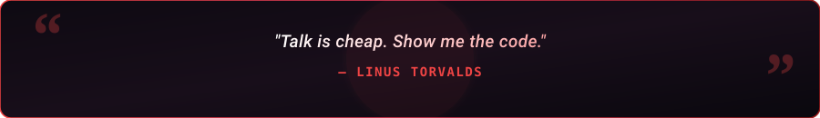

  

  

  
  &nbsp;
  
  &nbsp;
  

  

---

<h2 align="center">🔴 About Me</h2>

  

  

  Hey! I'm <b>Rohit Sahu</b>, a passionate <b>Computer Science Engineer & Developer</b> based in India. 
  I specialize in architecting scalable full-stack web platforms, working with modern software stacks, and building impactful digital solutions to solve real-world problems.

  
  &nbsp;
  
  &nbsp;
  

  💬 <b>Let's Discuss:</b> JavaScript, TypeScript, React, Node.js, Python, Databases & System Architecture. 
  ⚡ <b>Philosophy:</b> <i>"Turning complex problems into clean, reliable, and scalable code!"</i>

<table width="100%" border="0" align="center">
<tr>
<td width="50%" align="center" style="padding: 14px;">
  <h4>🔭 Active Focus</h4>
  
<b>Full-Stack Development</b> Scalable Web Apps &amp; Backend Systems

</td>
<td width="50%" align="center" style="padding: 14px;">
  <h4>🌱 Deep Dives</h4>
  
<b>DSA &amp; Modern Frameworks</b> Cloud Technologies &amp; Clean Architecture

</td>
</tr>
<tr>
<td width="50%" align="center" style="padding: 14px;">
  <h4>🤝 Collaboration</h4>
  
<b>Open Source &amp; Projects</b> Always open to building cool stuff

</td>
<td width="50%" align="center" style="padding: 14px;">
  <h4>📫 Get In Touch</h4>
  
<a href="mailto:sahurohit16620@gmail.com"><b>sahurohit16620@gmail.com</b></a> Direct discussions &amp; inquiries

</td>
</tr>
</table>

---

<h2 align="center">🛠️ Tech Stack & Skills</h2>

<b>Core Programming Languages</b>

  

<b>Frontend & UI Frameworks</b>

  

<b>Backend, Cloud & Databases</b>

  

<b>Tools, DevOps & Architecture</b>

  

  
  &nbsp;
  
  &nbsp;
  

---

<h2 align="center">📊 GitHub Analytics & Activity</h2>

  
  &nbsp;&nbsp;
  

  

  

---

<h2 align="center">⚡ Contribution Journey</h2>

  

---

<h2 align="center">📬 Let's Connect &amp; Collaborate</h2>

<i>Whether you want to discuss system architecture, explore open-source collaboration, or just say hello — my inbox is always open!</i>

<table border="0" align="center">
<tr>
<td align="center" width="260" style="padding: 16px;">
  <a href="https://www.linkedin.com/in/rohit-sahu-195a10331/" target="_blank">
    
      
    
  </a>
   
  <b>Professional Network</b>
</td>
<td align="center" width="260" style="padding: 16px;">
  <a href="mailto:sahurohit16620@gmail.com">
    
      
    
  </a>
   
  <b>Direct Collaboration</b>
</td>
<td align="center" width="260" style="padding: 16px;">
  <a href="https://github.com/Rohit-620" target="_blank">
    
      
    
  </a>
   
  <b>Check Out Repositories</b>
</td>
</tr>
</table>

  

